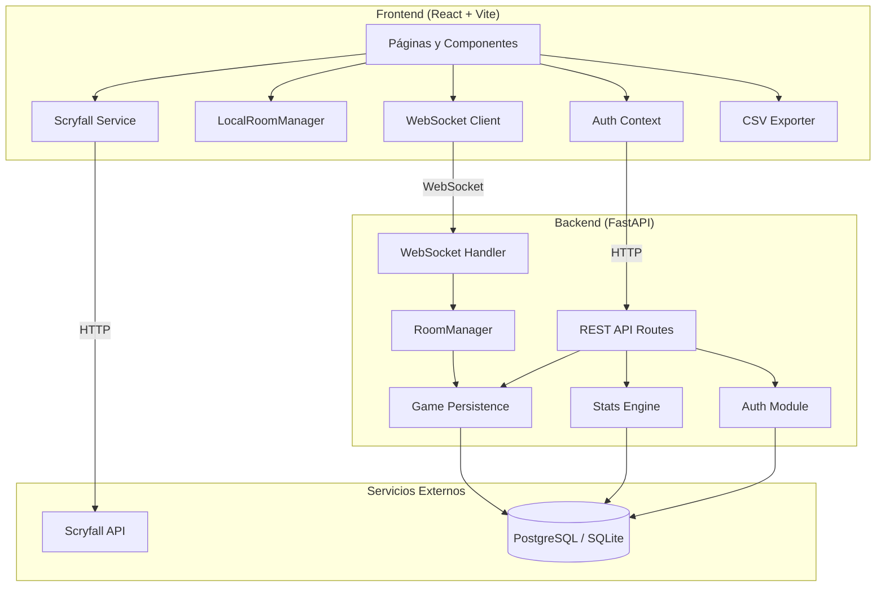
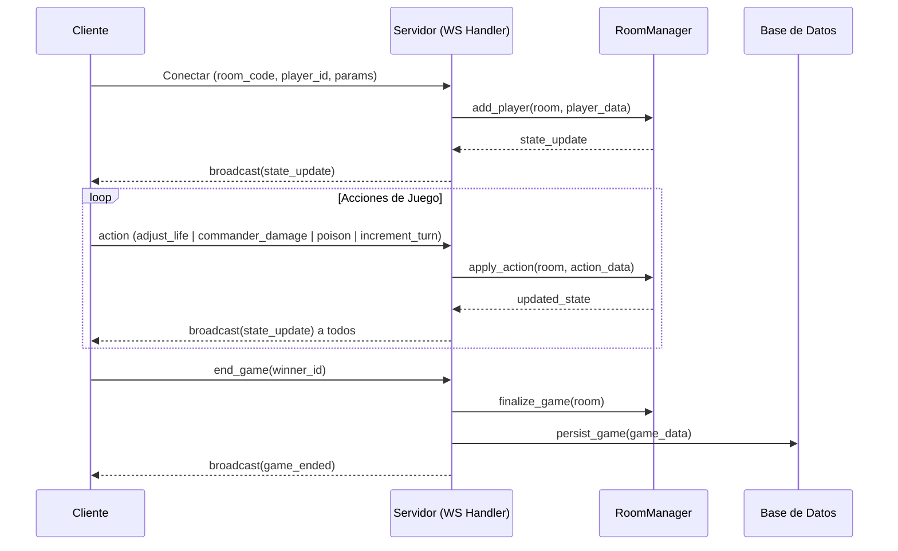
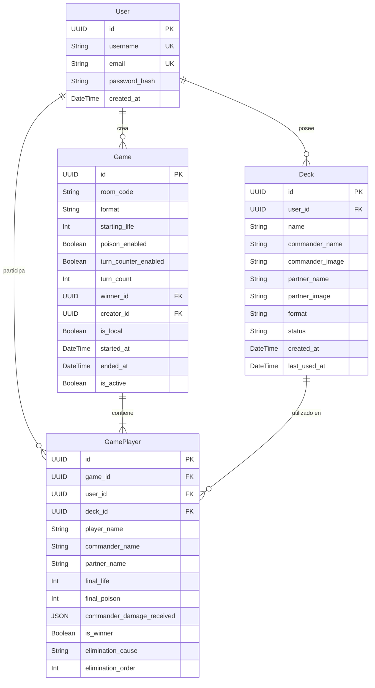

# Documento de Diseño Técnico

## Overview

MTG Life Counter es una aplicación web multijugador en tiempo real para rastrear puntos de vida en partidas de Magic: The Gathering. El sistema extiende la arquitectura existente (FastAPI + WebSockets en backend, React + TypeScript + Vite en frontend) para soportar 21 requerimientos que incluyen: gestión de salas con códigos únicos, sincronización en tiempo real de vida/veneno/daño de comandante, integración con Scryfall, historial de partidas, estadísticas por mazo y rival, colección de mazos, exportación CSV, selección aleatoria de jugador inicial, detección del último jugador en pie, y modo sala local.

### Decisiones de Diseño Clave

1. **Extensión incremental**: Se construye sobre la arquitectura existente sin reemplazar componentes funcionales.
2. **Estado en memoria + persistencia en BD**: El `RoomManager` gestiona el estado en vivo de las salas en memoria; al finalizar se persiste en PostgreSQL.
3. **WebSocket como canal único de juego**: Todas las acciones de partida (vida, veneno, daño, turnos) fluyen por WebSocket. REST se usa para historial, estadísticas y gestión de mazos.
4. **Sala Local como variante cliente-only**: Las salas locales replican la lógica del `RoomManager` en el frontend sin WebSocket.
5. **Scryfall como servicio externo no-crítico**: Fallos en Scryfall nunca bloquean la funcionalidad del juego.

## Architecture

### Diagrama de Arquitectura General



### Diagrama de Flujo WebSocket



## Components and Interfaces

### Backend

#### 1. RoomManager (Extensión)

Extiende el `RoomManager` existente para soportar veneno, partners, configuración de sala, y eliminaciones.

```python
# Interfaz extendida
class RoomConfig:
    format: str              # "commander" | "20vida" | "custom"
    starting_life: int
    poison_enabled: bool
    turn_counter_enabled: bool

class PlayerState:
    id: str
    username: str
    life: int
    poison_counters: int
    commander_name: str
    commander_image: str
    partner_name: str        # Nuevo: segundo comandante
    partner_image: str       # Nuevo: imagen del partner
    commander_damage: dict[str, int]  # commander_source_id -> damage
    is_connected: bool
    elimination_cause: str | None     # "daño normal" | "daño de comandante" | "veneno"
    elimination_order: int | None
    websocket: WebSocket | None
    deck_id: str | None      # Nuevo: referencia al mazo de "Mis Mazos"

class Room:
    code: str
    config: RoomConfig
    players: dict[str, PlayerState]
    turn_count: int
    elimination_counter: int  # Nuevo: track del próximo orden de eliminación
    is_local: bool            # Nuevo: marca si es sala local
    creator_id: str | None    # Nuevo: usuario creador
```

**Métodos nuevos:**
- `adjust_poison(room, target_id, amount)` — Ajusta veneno, clamp a 0 mínimo
- `apply_commander_damage_v2(room, commander_source_id, to_id, amount)` — Daño con ajuste de vida automático y soporte partners
- `check_elimination(room, player_id)` — Evalúa causa de eliminación
- `revive_player(room, player_id)` — Cancela eliminación si vida > 0
- `select_random_starter(room)` — Selección aleatoria de jugador
- `finalize_game(room, winner_id)` — Cierra partida y prepara datos para persistencia

#### 2. WebSocket Handler (Extensión)

Extiende el handler existente con nuevas acciones:

```python
# Acciones WebSocket soportadas
ACTIONS = {
    "adjust_life",          # Existente: {targetId, amount}
    "commander_damage",     # Extendido: {commanderSourceId, toId, amount}
    "adjust_poison",        # Nuevo: {targetId, amount}
    "increment_turn",       # Existente
    "select_starter",       # Nuevo: sin params, servidor elige y broadcast
    "end_game",             # Extendido: {winnerId}
    "restart_game",         # Nuevo: reinicia con mismos jugadores
}
```

**Protocolo de mensajes servidor→cliente:**
```json
{
    "type": "state_update",
    "roomCode": "ABC123",
    "format": "commander",
    "config": {"poisonEnabled": true, "turnCounterEnabled": true},
    "turnCount": 5,
    "players": [...],
    "eliminationOrder": [...]
}

{
    "type": "starter_selected",
    "playerId": "uuid",
    "playerName": "Nombre"
}

{
    "type": "game_ended",
    "winnerId": "uuid",
    "winnerName": "Nombre"
}

{
    "type": "error",
    "message": "La sala está llena (máximo 12 jugadores)"
}
```

#### 3. REST API — Endpoints Nuevos

| Método | Ruta | Descripción |
|--------|------|-------------|
| GET | `/api/games/history` | Historial con causa de eliminación (existente, extender) |
| GET | `/api/games/stats` | Estadísticas generales (existente, extender) |
| GET | `/api/games/stats/by-deck` | Estadísticas por mazo |
| GET | `/api/games/stats/by-rival` | Estadísticas por rival |
| GET | `/api/games/stats/log` | Log de partidas completo |
| PUT | `/api/games/{game_id}/edit` | Editar historial de partida |
| GET | `/api/decks` | Listar mazos del usuario |
| POST | `/api/decks` | Crear mazo |
| PUT | `/api/decks/{deck_id}` | Actualizar mazo (estado) |
| DELETE | `/api/decks/{deck_id}` | Eliminar mazo |
| GET | `/api/commanders` | Registro de comandantes del usuario |
| POST | `/api/rooms/validate/{code}` | Validar existencia de sala |

#### 4. Stats Engine (Nuevo módulo)

```python
class StatsEngine:
    async def get_general_stats(user_id: UUID) -> GeneralStats
    async def get_stats_by_deck(user_id: UUID) -> list[DeckStats]
    async def get_stats_by_rival(user_id: UUID) -> list[RivalStats]
    async def get_game_log(user_id: UUID) -> list[GameLogEntry]
    async def recalculate_affected_stats(game_id: UUID) -> None
```

### Frontend

#### 5. Estructura de Páginas (Extensión)

```
src/
├── pages/
│   ├── Home.tsx           # Extender: opciones veneno, turnos, custom life, sala local
│   ├── Game.tsx           # Extender: veneno, partners, eliminaciones, starter
│   ├── LocalGame.tsx      # Nuevo: sala local sin WebSocket
│   ├── History.tsx        # Extender: causa eliminación, edición
│   ├── Stats.tsx          # Nuevo: estadísticas por mazo/rival + exportar CSV
│   ├── Decks.tsx          # Nuevo: gestión de "Mis Mazos"
│   ├── Login.tsx          # Existente
│   └── Register.tsx       # Existente
├── components/
│   ├── CommanderSearch.tsx # Extender: soporte Partner
│   ├── LifeCounter.tsx    # Nuevo: componente reusable con long-press
│   ├── PoisonCounter.tsx  # Nuevo: contador de veneno
│   ├── CmdDamagePanel.tsx # Nuevo: panel daño comandante con partners
│   ├── StarterPicker.tsx  # Nuevo: animación ruleta
│   ├── PlayerCard.tsx     # Nuevo: tarjeta de jugador extraída de Game.tsx
│   ├── DeckSelector.tsx   # Nuevo: toggle "Mis Mazos"
│   └── CSVExporter.tsx    # Nuevo: lógica de exportación
├── hooks/
│   ├── useWebSocket.ts    # Nuevo: hook de conexión WS con reconexión
│   ├── useLongPress.ts    # Nuevo: hook para long-press (±10)
│   └── useLocalRoom.ts    # Nuevo: lógica de sala local
├── services/
│   ├── scryfall.ts        # Existente
│   ├── api.ts             # Nuevo: cliente REST centralizado
│   └── csv.ts             # Nuevo: generación CSV
├── context/
│   └── AuthContext.tsx    # Nuevo: contexto de autenticación
└── types/
    └── game.ts            # Extender con nuevos tipos
```

#### 6. LocalRoomManager (Nuevo)

Réplica de la lógica del `RoomManager` del backend ejecutada completamente en el cliente para el modo Sala Local:

```typescript
class LocalRoomManager {
  private room: LocalRoom;

  createRoom(config: RoomConfig): void;
  addPlayer(name: string, commander?: CommanderInfo): void;
  removePlayer(playerId: string): void;
  adjustLife(targetId: string, amount: number): void;
  adjustPoison(targetId: string, amount: number): void;
  applyCommanderDamage(sourceId: string, targetId: string, amount: number): void;
  incrementTurn(): void;
  selectRandomStarter(): string;
  checkElimination(playerId: string): EliminationResult | null;
  revivePlayer(playerId: string): void;
  endGame(winnerId: string): GameResult;
  restartGame(): void;
  getState(): RoomState;
}
```

#### 7. Hook useLongPress

```typescript
function useLongPress(
  onShortPress: () => void,
  onLongPress: () => void,
  threshold: number = 500
): {
  onPointerDown: () => void;
  onPointerUp: () => void;
  onPointerLeave: () => void;
}
```

Permite diferenciar entre tap (±1) y long-press (±10) en todos los contadores.

## Data Models

### Diagrama Entidad-Relación



### Modelos SQLAlchemy (Extensiones)

#### Game (Extendido)

```python
class Game(Base):
    __tablename__ = "games"

    id = Column(UUID(as_uuid=True), primary_key=True, default=uuid.uuid4)
    room_code = Column(String(10), nullable=False, index=True)
    format = Column(String(20), nullable=False)
    starting_life = Column(Integer, nullable=False)
    poison_enabled = Column(Boolean, default=False)         # Nuevo
    turn_counter_enabled = Column(Boolean, default=False)   # Nuevo
    turn_count = Column(Integer, nullable=True)             # Nullable si turnos deshabilitados
    winner_id = Column(UUID(as_uuid=True), ForeignKey("users.id"), nullable=True)
    creator_id = Column(UUID(as_uuid=True), ForeignKey("users.id"), nullable=True)  # Nuevo
    is_local = Column(Boolean, default=False)               # Nuevo
    started_at = Column(DateTime(timezone=True), default=lambda: datetime.now(timezone.utc))
    ended_at = Column(DateTime(timezone=True), nullable=True)
    is_active = Column(Boolean, default=True)
```

#### GamePlayer (Extendido)

```python
class GamePlayer(Base):
    __tablename__ = "game_players"

    id = Column(UUID(as_uuid=True), primary_key=True, default=uuid.uuid4)
    game_id = Column(UUID(as_uuid=True), ForeignKey("games.id"), nullable=False)
    user_id = Column(UUID(as_uuid=True), ForeignKey("users.id"), nullable=True)
    deck_id = Column(UUID(as_uuid=True), ForeignKey("decks.id"), nullable=True)  # Nuevo
    player_name = Column(String(50), nullable=False)
    commander_name = Column(String(100), nullable=True)
    partner_name = Column(String(100), nullable=True)      # Nuevo
    final_life = Column(Integer, nullable=True)
    final_poison = Column(Integer, nullable=True)           # Nuevo
    commander_damage_received = Column(JSON, default=dict)
    is_winner = Column(Boolean, default=False)
    elimination_cause = Column(String(30), nullable=True)   # Nuevo
    elimination_order = Column(Integer, nullable=True)      # Nuevo
```

#### Deck (Nuevo)

```python
class Deck(Base):
    __tablename__ = "decks"

    id = Column(UUID(as_uuid=True), primary_key=True, default=uuid.uuid4)
    user_id = Column(UUID(as_uuid=True), ForeignKey("users.id"), nullable=False)
    name = Column(String(100), nullable=False)
    commander_name = Column(String(100), nullable=True)
    commander_image = Column(String(500), nullable=True)
    partner_name = Column(String(100), nullable=True)
    partner_image = Column(String(500), nullable=True)
    format = Column(String(20), nullable=False)            # "commander" | "20vida" | "custom"
    status = Column(String(20), default="active")          # "active" | "inactive"
    created_at = Column(DateTime(timezone=True), default=lambda: datetime.now(timezone.utc))
    last_used_at = Column(DateTime(timezone=True), nullable=True)
```

### Tipos TypeScript (Extensión)

```typescript
export type GameFormat = 'commander' | '20vida' | 'custom'

export type EliminationCause = 'daño normal' | 'daño de comandante' | 'veneno'

export interface RoomConfig {
  format: GameFormat
  startingLife: number
  poisonEnabled: boolean
  turnCounterEnabled: boolean
}

export interface Player {
  id: string
  username: string
  life: number
  poisonCounters: number
  commanderDamage: Record<string, number>  // commanderSourceId -> damage
  commanderName?: string
  commanderImage?: string
  partnerName?: string
  partnerImage?: string
  isConnected: boolean
  eliminationCause?: EliminationCause
  eliminationOrder?: number
  deckId?: string
}

export interface DeckRecord {
  id: string
  name: string
  commanderName?: string
  commanderImage?: string
  partnerName?: string
  partnerImage?: string
  format: GameFormat
  status: 'active' | 'inactive'
  totalGames: number
  winRate: number
  lastUsedAt?: string
}

export interface GeneralStats {
  totalGames: number
  wins: number
  winRate: number
  eliminationsByNormal: number
  eliminationsByCommander: number
  eliminationsByPoison: number
}

export interface DeckStats {
  deckId: string
  deckName: string
  totalGames: number
  wins: number
  winRate: number
  players: string[]  // jugadores que han usado este mazo
}

export interface RivalStats {
  rivalName: string
  totalGames: number
  userWins: number
  winRate: number
}

export interface GameLogEntry {
  date: string
  players: { name: string; deck?: string; eliminationOrder?: number }[]
}
```

## Correctness Properties

*Una propiedad es una característica o comportamiento que debe mantenerse verdadera en todas las ejecuciones válidas de un sistema—esencialmente, una declaración formal sobre lo que el sistema debe hacer. Las propiedades sirven como puente entre especificaciones legibles por humanos y garantías de correctitud verificables por máquina.*

### Property 1: Formato del código de sala

*Para cualquier* código de sala generado por el sistema, el código SHALL tener exactamente 6 caracteres y cada carácter SHALL ser una letra mayúscula (A-Z) o un dígito (0-9).

**Validates: Requirements 1.1**

### Property 2: Vida inicial según formato

*Para cualquier* formato válido y su vida inicial correspondiente (Commander→40, 20vida→20, Custom→valor ingresado), cuando un jugador se une a una sala con ese formato, su vida inicial SHALL ser exactamente el valor correspondiente al formato.

**Validates: Requirements 1.4, 4.9, 11.2**

### Property 3: Máximo de jugadores por sala

*Para cualquier* sala activa y cualquier secuencia de operaciones de unión de jugadores, el número de jugadores conectados simultáneamente SHALL nunca exceder 12.

**Validates: Requirements 1.5, 3.8**

### Property 4: Validación de código de sala

*Para cualquier* string de entrada, la validación de código de sala SHALL aceptar el código si y solo si tiene exactamente 6 caracteres compuestos exclusivamente por letras mayúsculas (A-Z) y dígitos (0-9).

**Validates: Requirements 2.1, 2.2**

### Property 5: Validación de nombre de jugador

*Para cualquier* string de entrada como nombre de jugador, el sistema SHALL aceptar el nombre si y solo si su longitud está entre 1 y 30 caracteres inclusive.

**Validates: Requirements 2.3, 2.7**

### Property 6: Aritmética de vida (ajuste de vida)

*Para cualquier* jugador con vida actual N y cualquier cantidad de ajuste A (positiva o negativa), tras aplicar adjust_life(targetId, A), la vida resultante del jugador SHALL ser exactamente N + A, sin límite inferior ni superior.

**Validates: Requirements 4.3, 4.4, 4.7**

### Property 7: Ajuste de vida sobre jugador inexistente

*Para cualquier* estado de sala y cualquier ID de jugador que no existe en la sala, aplicar adjust_life con ese ID SHALL dejar el estado de todos los jugadores sin modificar.

**Validates: Requirements 4.10**

### Property 8: Imagen de carta doble cara

*Para cualquier* carta de Scryfall que no tiene `image_uris` en el nivel raíz pero tiene `card_faces` con imágenes, la función `getCardImageUrl` SHALL retornar la URL de la imagen de la primera cara.

**Validates: Requirements 5.7**

### Property 9: Daño de comandante reduce vida automáticamente

*Para cualquier* jugador destino con vida N y cualquier incremento de daño de comandante +X (X > 0), tras aplicar la acción, la vida del jugador destino SHALL ser N - X y el daño acumulado SHALL incrementarse en X.

**Validates: Requirements 6.3, 6.9**

### Property 10: Decremento de daño de comandante incrementa vida

*Para cualquier* jugador destino con vida N y daño de comandante acumulado D >= X, decrementar daño de comandante en X SHALL resultar en vida N + X y daño acumulado D - X.

**Validates: Requirements 6.4**

### Property 11: Daño de comandante no puede ser negativo

*Para cualquier* valor de daño de comandante acumulado y cualquier operación de decremento, el valor resultante SHALL ser mayor o igual a 0. Si el decremento resultaría en un valor negativo, el sistema SHALL establecer el valor en 0 sin modificar la vida.

**Validates: Requirements 6.8**

### Property 12: Detección de eliminación por daño de comandante

*Para cualquier* jugador destino y cualquier fuente de comandante, cuando el daño acumulado de esa fuente alcanza o supera 21 puntos, el sistema SHALL señalar eliminación por "daño de comandante" si la vida permanece > 0, o "daño normal" si la vida es <= 0.

**Validates: Requirements 6.10, 17.1, 17.2, 17.3**

### Property 13: Cálculo del porcentaje de victorias

*Para cualquier* par de valores (victorias, total_partidas) donde total_partidas > 0, el porcentaje de victorias SHALL ser exactamente round((victorias / total_partidas) * 100, 1).

**Validates: Requirements 9.2**

### Property 14: Incremento de turno

*Para cualquier* sala con contador de turnos habilitado y valor actual T, la acción increment_turn SHALL resultar en un valor T + 1.

**Validates: Requirements 10.1**

### Property 15: Aritmética de veneno y clamping a 0

*Para cualquier* jugador con veneno actual V y cualquier ajuste A, el veneno resultante SHALL ser max(0, V + A). El valor nunca SHALL ser inferior a 0.

**Validates: Requirements 13.4, 13.5, 13.8**

### Property 16: Detección de eliminación por veneno

*Para cualquier* jugador cuyo contador de veneno alcanza o supera 10, el sistema SHALL señalar eliminación por "veneno" independientemente de la vida actual.

**Validates: Requirements 13.9, 17.4**

### Property 17: Selección aleatoria dentro de la lista de jugadores

*Para cualquier* sala con N jugadores activos (N >= 2), el jugador seleccionado aleatoriamente SHALL ser un miembro de la lista de jugadores activos de esa sala.

**Validates: Requirements 15.2**

### Property 18: Detección del último jugador en pie

*Para cualquier* sala con 2 o más jugadores registrados, si exactamente un jugador tiene vida > 0 y todos los demás tienen vida <= 0, el sistema SHALL detectar la condición de último jugador en pie.

**Validates: Requirements 16.1, 16.7**

### Property 19: Orden de eliminación secuencial

*Para cualquier* secuencia de eliminaciones en una partida, los valores de orden SHALL ser enteros secuenciales comenzando en 1, sin huecos. Al revivir un jugador, las posiciones posteriores SHALL ajustarse para mantener la secuencia continua.

**Validates: Requirements 17.5, 17.9**

### Property 20: Reconexión restaura estado completo

*Para cualquier* jugador con estado (vida L, daño de comandante D, veneno P, nombre de comandante C), al desconectarse y reconectarse dentro de 30 minutos, el estado restaurado SHALL ser idéntico al estado previo a la desconexión.

**Validates: Requirements 3.6**

### Property 21: CSV con formato correcto

*Para cualquier* conjunto de estadísticas de usuario, el CSV generado SHALL tener codificación UTF-8, usar coma como separador, incluir headers en español, y cada valor numérico de porcentaje SHALL estar redondeado a 1 decimal.

**Validates: Requirements 20.3**

### Property 22: Validación de registro de usuario

*Para cualquier* input de registro con username entre 3-50 caracteres, email con formato válido (máximo 255 chars), y contraseña de mínimo 6 caracteres, el registro SHALL ser exitoso. Para cualquier input que no cumpla estas restricciones, el registro SHALL ser rechazado.

**Validates: Requirements 7.1, 7.3**

## Error Handling

### Backend

| Escenario | Respuesta | Código HTTP |
|-----------|-----------|-------------|
| Sala no encontrada (REST) | `{"detail": "Sala no encontrada"}` | 404 |
| Sala llena (WebSocket) | Mensaje tipo `error` + cierre de conexión | WS close 4001 |
| Token JWT inválido/expirado | `{"detail": "Token inválido o expirado"}` | 401 |
| Formato de código inválido | `{"detail": "Código de sala inválido"}` | 400 |
| Usuario/email duplicado (registro) | `{"detail": "Email o usuario ya registrado"}` | 400 |
| Validación de campos (registro) | `{"detail": "Campo X inválido: ..."}` | 422 |
| Jugador no pertenece a la sala (acción) | Descarta acción silenciosamente | — |
| Mazo no encontrado | `{"detail": "Mazo no encontrado"}` | 404 |
| Partida no editable por usuario | `{"detail": "Sin permisos para editar esta partida"}` | 403 |
| Error interno | `{"detail": "Error interno del servidor"}` | 500 |

### Frontend

| Escenario | Comportamiento |
|-----------|---------------|
| WebSocket desconectado | Indicador rojo, cola de acciones, 3 reintentos |
| Error de Scryfall (404/red) | Lista vacía, sin mensaje de error al usuario |
| Imagen de comandante no carga | Fondo de color por defecto |
| Token expirado | Redirección a login con mensaje |
| Timeout en carga de historial (10s) | Mostrar lista vacía |
| No autenticado accede a historial | Lista vacía sin error |
| No autenticado crea sala local | Redirección a login con mensaje |

### WebSocket — Reconexión

```
1. Desconexión detectada → indicador amarillo pulsante
2. Intento 1 (inmediato) → reconectar con mismo player_id
3. Intento 2 (2s) → reconectar
4. Intento 3 (4s) → reconectar
5. Tras 3 fallos → indicador rojo, botón "Reintentar" manual
```

### Servidor — Timeout de Sala

- Jugador sin reconectar en 30 min → estado `desconectado` permanente
- Sala sin jugadores conectados durante 60 min → limpieza automática de memoria
- Partidas activas se marcan como finalizadas si todos se desconectan por 60 min

## Testing Strategy

### Testing de Propiedades (Property-Based Testing)

**Librería**: `hypothesis` (Python, backend) + `fast-check` (TypeScript, frontend)

Las propiedades de correctitud definidas anteriormente se implementan como tests de propiedades con un mínimo de 100 iteraciones por propiedad. Cada test incluye un comentario de trazabilidad:

```python
# Feature: mtg-life-counter, Property 6: Aritmética de vida
@given(life=st.integers(), amount=st.integers())
def test_adjust_life_arithmetic(life, amount):
    ...
```

```typescript
// Feature: mtg-life-counter, Property 4: Validación de código de sala
fc.assert(fc.property(fc.string(), (code) => { ... }), { numRuns: 100 })
```

**Propiedades por componente:**

| Componente | Propiedades |
|-----------|-------------|
| RoomManager (vida) | P2, P3, P6, P7 |
| RoomManager (veneno) | P15, P16 |
| RoomManager (daño cmd) | P9, P10, P11, P12 |
| RoomManager (eliminación) | P18, P19 |
| RoomManager (turnos) | P14 |
| Validación (código/nombre) | P1, P4, P5 |
| Scryfall Service | P8 |
| Stats Engine | P13 |
| Auth / Registro | P22 |
| Selección aleatoria | P17 |
| Reconexión | P20 |
| CSV Export | P21 |

### Tests Unitarios (Example-Based)

- Configuración de sala: opciones veneno, turnos, custom life
- Flujo de registro/login con datos concretos
- Historial con partidas reales guardadas
- Edición de historial: cambio de causa y orden
- Gestión de mazos: CRUD completo
- Sala local: creación y flujo completo sin WebSocket
- Animación de starter: verificar que se dispara correctamente

### Tests de Integración

- WebSocket end-to-end: conectar 2+ clientes, enviar acciones, verificar broadcast
- Persistencia: finalizar partida y verificar datos en BD
- Reconexión WebSocket: desconectar y reconectar, verificar restauración de estado
- REST endpoints con autenticación: historial, stats, decks
- Scryfall: búsqueda con debounce y manejo de errores

### Configuración de Test

- **Backend**: `pytest` + `pytest-asyncio` + `hypothesis`
- **Frontend**: `vitest` + `@testing-library/react` + `fast-check`
- **CI**: Ejecutar tests unitarios + propiedades en cada PR
- **Mínimo 100 iteraciones** por test de propiedad
- **Tag format**: `Feature: mtg-life-counter, Property {N}: {título}`

